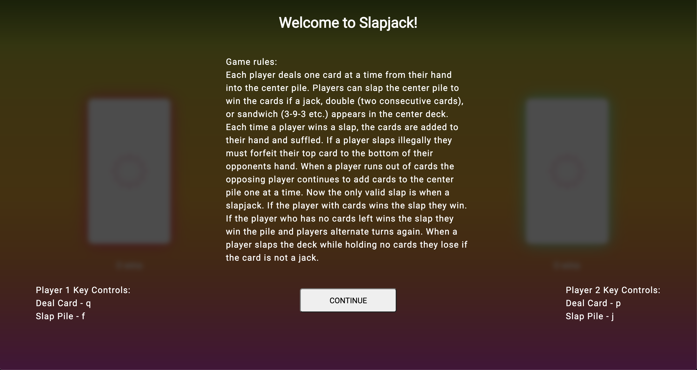
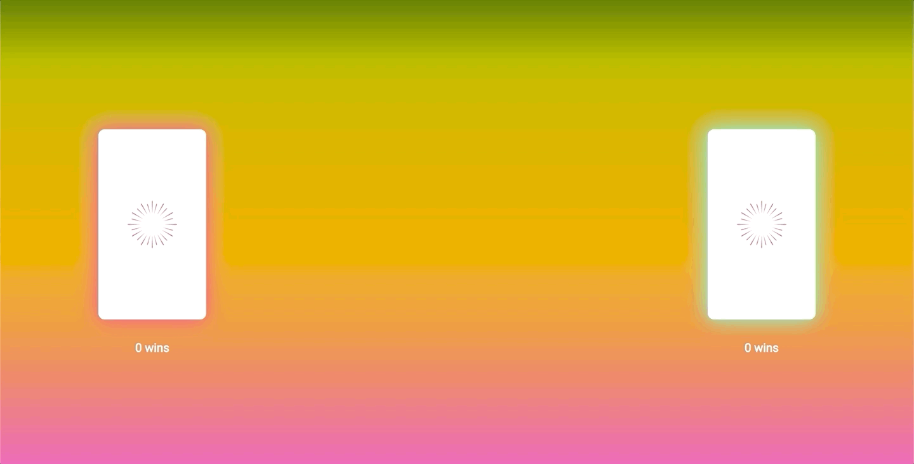
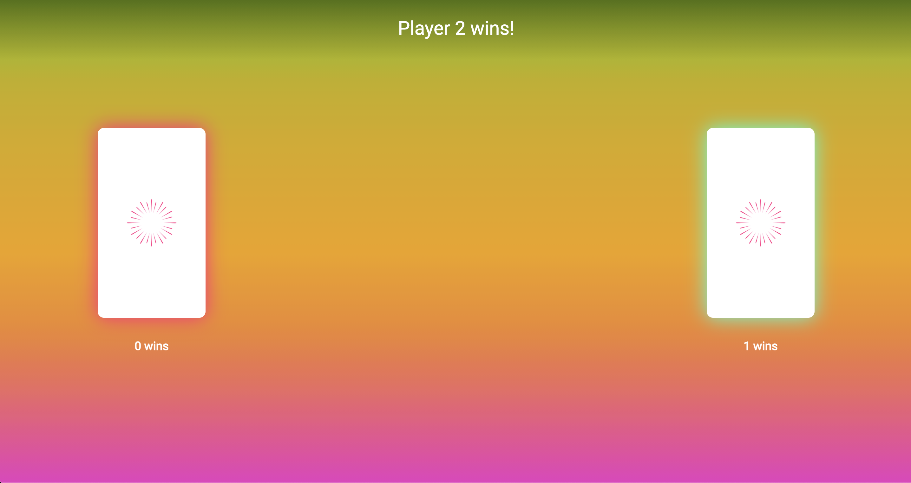

# Slapjack

## Creator

Steven Mancine

## Technologies

* JavaScript
* HTML
* CSS

## Using the app:

* Upon load users are greeted with a welcome message explaining the rules of the game. There are different ways to win the cards in the center pile.
* Each player has there own key controls for dealing cards to the center pile or slapping.

* As players deal into the middle deck, the border color of the pile changes to indicate which player added the card to the deck.
* Images and alt texts are updated dynamically via javaScript functions.

* When a player wins with a slap a message appear at the top of the page and those cards are added to the winners hand and shuffled.
* If an illegal slap occurs the guilty player must forfeit one card to the other player.

* Once a player wins the game a message is displayed and the win count is updated below the decks of cards

### localStorage

* Local storage is used in two parts of this app.
1. When the user clicks the continue button on the welcome page, to prevent the same message from showing again upon reload.
2. For storage of player wins to persist data between reloads.

## Future Considerations

* Adding layers to card decks to indicate how many cards are in each pile. Players currently have no way to tell how many cards they are currently holding.
* Adding input boxes on the welcome screen to prompt each player to enter a name. Player names can be entered into the DOM dynamically for a better user experience.
* Alternate Gameplay rules. Egyptian rat screw is a very similar game that follows almost the same rules. At the welcome page users could be prompted to choose between which style they would like to play.